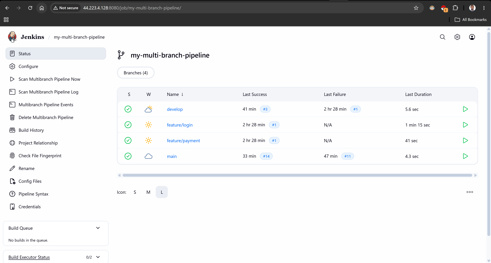
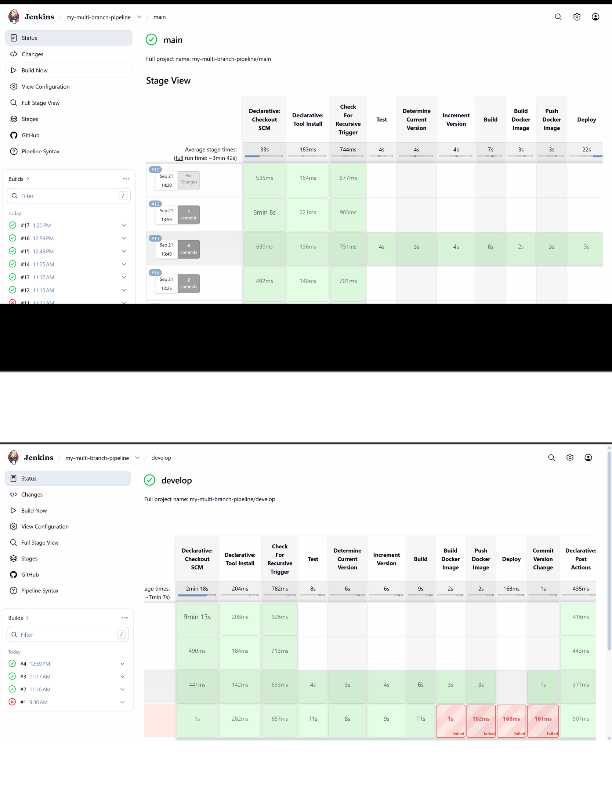
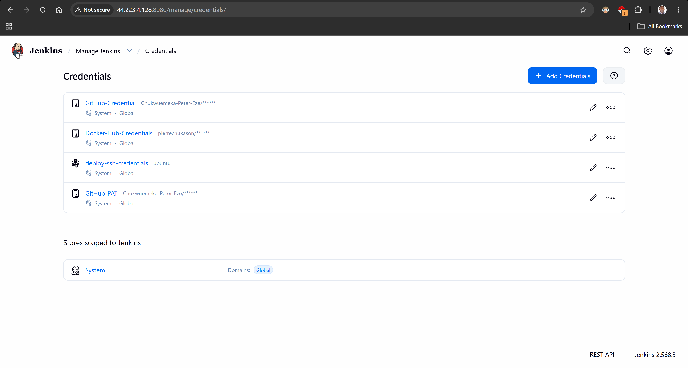
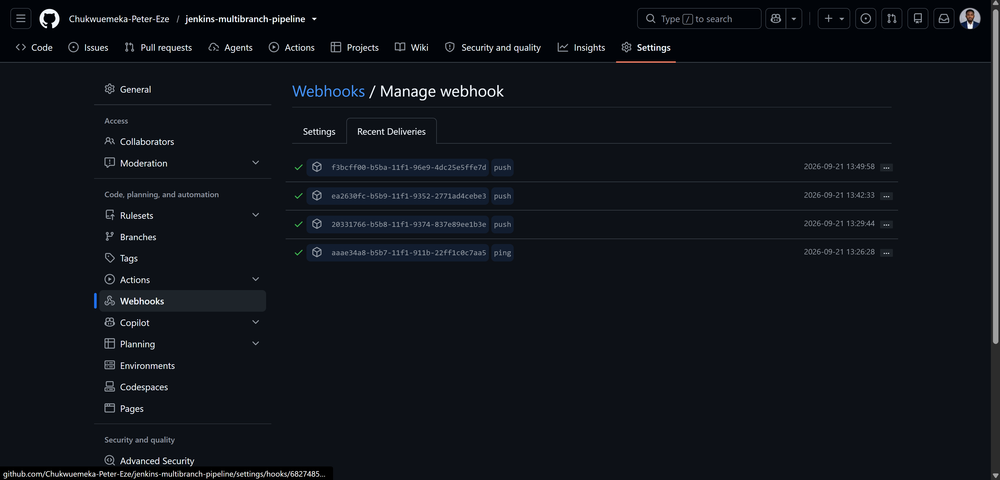
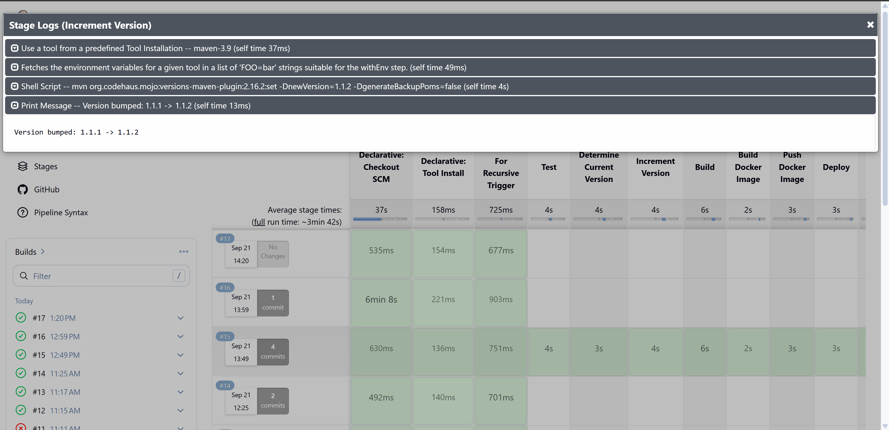
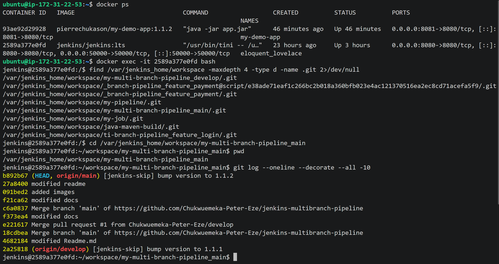

# Jenkins Multibranch Pipeline

> Branch-aware CI/CD workflows using Jenkins Multibranch Pipelines, secure credentials, Git webhooks, and automated application version management.

[](#)
[](#)
[](#)
[](#)
[](#)

---

## Table of Contents

* [Overview](#overview)
* [Engineering Problem](#engineering-problem)
* [Solution](#solution)
* [Project Objectives](#project-objectives)
* [Engineering Highlights](#engineering-highlights)
* [Architecture](#architecture)
* [CI/CD Workflow](#cicd-workflow)
* [Multibranch Pipeline](#multibranch-pipeline)
* [Branch-Based Pipeline Logic](#branch-based-pipeline-logic)
* [Credentials Management](#credentials-management)
* [Webhook Automation](#webhook-automation)
* [Application Versioning](#application-versioning)
* [Versioning Workflow](#versioning-workflow)
* [Docker Image Versioning](#docker-image-versioning)
* [Version Commit Workflow](#version-commit-workflow)
* [Preventing Recursive Pipeline Execution](#preventing-recursive-pipeline-execution)
* [Technology Stack](#technology-stack)
* [Repository Structure](#repository-structure)
* [Implementation](#implementation)
* [Security Considerations](#security-considerations)
* [Troubleshooting](#troubleshooting)
* [Engineering Decisions](#engineering-decisions)
* [Lessons Learned](#lessons-learned)
* [Future Improvements](#future-improvements)
* [Related Projects](#related-projects)
* [Connect](#connect)
* [License](#license)

---

## Overview

Modern application repositories commonly contain multiple branches representing different stages of development and delivery. A CI/CD system needs to discover these branches, execute the appropriate pipeline logic, respond to repository changes, securely access required resources, and manage application versions consistently.

This project implements a Jenkins-based approach using Multibranch Pipelines, branch-aware Jenkinsfiles, Jenkins Credentials, Git webhooks, automated application versioning, Docker image version alignment, automated commits from Jenkins, and protection against recursive pipeline execution.

The result is a branch-aware CI/CD workflow that connects source-control activity with automated build and delivery processes.

---

## Engineering Problem

A single static Jenkins pipeline becomes increasingly difficult to manage when a repository contains multiple active branches. Different branches require different behavior:

```text
feature/*
    ↓
Development validation

develop
    ↓
Integration workflow

main
    ↓
Production-oriented workflow
```

At the same time, the pipeline needs secure credentials to interact with external services and an automated mechanism for triggering builds when changes reach the repository.

Application versioning introduces another consideration. If the pipeline changes the application version and commits that change back to Git, the resulting commit can itself become a source-control event that triggers another pipeline execution.

> **The engineering challenge:** how can Jenkins automatically discover and build multiple branches, securely access required resources, respond to repository changes, manage application versions, and avoid unintended recursive execution?

---

## Solution

This project combines several Jenkins capabilities into one workflow.

```text
Git Repository
      │
      │ branch activity
      ▼
Git Webhook
      │
      ▼
Jenkins Multibranch Pipeline
      │
      ├── Discover branches
      │
      ├── Load branch Jenkinsfile
      │
      ├── Retrieve credentials
      │
      ├── Execute branch-specific logic
      │
      ├── Build application
      │
      ├── Update application version
      │
      ├── Build Docker image
      │
      └── Commit version change
               │
               ▼
          Git Repository
               │
               ▼
       Trigger protection
```

---

## Project Objectives

* Create a Jenkins Multibranch Pipeline.
* Implement Git-based branch discovery.
* Implement branch-specific pipeline logic.
* Configure secure Jenkins credentials.
* Trigger Jenkins execution through repository webhooks.
* Increment application versions, including from within the pipeline itself.
* Adjust the Dockerfile to support application versions.
* Run the complete pipeline end to end.
* Commit version changes from Jenkins back to Git.
* Prevent Jenkins-generated commits from recursively triggering the pipeline.

---

## Engineering Highlights

* Branch-aware CI/CD design.
* Pipeline-as-code.
* Automated source-control integration.
* Secure credential handling.
* Event-driven pipeline triggering.
* Automated semantic application-version management.
* Version-aware container image creation.
* Controlled write-back from CI to source control.
* Recursive-trigger prevention.
* Clear separation between source-control events and pipeline responsibilities.

---

## Architecture


### Conceptual Architecture

```text
                         ┌─────────────────────┐
                         │    Git Repository   │
                         │                     │
                         │ main                │
                         │ develop             │
                         │ feature/*           │
                         └──────────┬──────────┘
                                    │
                                    │ Webhook
                                    ▼
                         ┌─────────────────────┐
                         │      Jenkins        │
                         │                     │
                         │ Multibranch Job     │
                         └──────────┬──────────┘
                                    │
                      ┌─────────────┼─────────────┐
                      │             │             │
                      ▼             ▼             ▼
                  main         develop       feature/*
                      │             │             │
                      └─────────────┼─────────────┘
                                    │
                                    ▼
                              Jenkinsfile
                                    │
                         ┌──────────┼──────────┐
                         │          │          │
                         ▼          ▼          ▼
                     Build       Test     Version
                                               │
                                               ▼
                                         Docker Image
                                               │
                                               ▼
                                          Git Commit
                                               │
                                               ▼
                                     Trigger Protection
```

---

## CI/CD Workflow

```text
Developer pushes change
        ↓
Git repository receives change
        ↓
Webhook notifies Jenkins
        ↓
Jenkins identifies affected branch
        ↓
Multibranch Pipeline selects branch
        ↓
Branch Jenkinsfile is loaded
        ↓
Credentials are retrieved securely
        ↓
Application is built and tested
        ↓
Application version is updated
        ↓
Docker image is built
        ↓
Version change is committed
        ↓
Jenkins prevents its own commit
from causing an unintended recursive build
```

---

## Multibranch Pipeline

A Multibranch Pipeline lets Jenkins discover branches containing pipeline definitions and create corresponding pipeline jobs automatically, rather than manually creating an individual Jenkins job for every branch.

### Concept

```text
Repository
│
├── main
│   └── Jenkinsfile
│
├── develop
│   └── Jenkinsfile
│
├── feature/login
│   └── Jenkinsfile
│
└── feature/payment
    └── Jenkinsfile
```

Jenkins discovers the branches and evaluates the pipeline definition associated with each one.



---

## Branch-Based Pipeline Logic

The pipeline inspects the current branch and applies branch-specific behavior.

```text
if main
    → production-oriented workflow

if develop
    → integration workflow

if feature/*
    → validation workflow
```



---

## Credentials Management

CI/CD pipelines frequently require authentication to external systems: source-control repositories, container registries, artifact repositories, cloud platforms, and deployment targets.

Credentials are never hard-coded into Jenkinsfiles. Instead, Jenkins Credentials provide controlled access to sensitive values.

```text
Jenkinsfile
     │
     │ references credential
     ▼
Jenkins Credentials Store
     │
     ▼
Authenticated operation
```



---

## Webhook Automation

Manual pipeline execution doesn't provide a fully event-driven CI/CD workflow. A webhook lets the source-control system notify Jenkins when relevant repository activity occurs.

```text
Git Push
   │
   ▼
Webhook Event
   │
   ▼
Jenkins
   │
   ▼
Multibranch Pipeline
   │
   ▼
Build
```



**Security considerations:** authentication, secret tokens where supported, source validation, network exposure, Jenkins security configuration, and logging/monitoring all matter here, a webhook endpoint is an entry point into the CI system.

---

## Application Versioning

Application versioning provides a traceable relationship between source code, application version, container image, and deployment artifact:

```text
Source Code
    ↓
Application Version
    ↓
Container Image
    ↓
Deployment Artifact
```

This project increments the application version both locally and within the Jenkins Pipeline itself.

---

## Versioning Workflow

```text
Current Version
      │
      ▼
Version Increment
      │
      ▼
Updated Application Version
      │
      ├───────────────┐
      ▼               ▼
Application       Docker Image
Version           Version
      │               │
      └───────┬───────┘
              ▼
         Git Commit
```



---

## Docker Image Versioning

The application version is reflected directly in the container image strategy:

```text
Application Version
        │
        ▼
Docker Image Tag
```

The Dockerfile and pipeline configuration are aligned with the versioning strategy so the image tag always matches the application version that produced it.

---

## Version Commit Workflow

```text
Pipeline starts
     ↓
Determine next version
     ↓
Update application version
     ↓
Update Docker-related version reference
     ↓
Build / validate
     ↓
Commit version change
     ↓
Push to Git
```



---

## Preventing Recursive Pipeline Execution

Automated Git commits introduce a potential feedback loop:

```text
Pipeline
   ↓
Updates version
   ↓
Commits to Git
   ↓
Git generates push event
   ↓
Webhook
   ↓
Pipeline starts again
   ↓
Version changes again
   ↓
...
```

This is intentionally controlled so it doesn't happen.

**Actual behavior:**

```text
Developer Commit
      ↓
Webhook
      ↓
Pipeline
      ↓
Jenkins Version Commit
      ↓
Webhook
      ↓
Commit identified as Jenkins-generated
      ↓
Pipeline execution ignored
```

This is a core part of the project's engineering design, not just a configuration detail.

---

## Technology Stack

| Technology                   | Purpose                                  |
| ----------------------------- | ------------------------------------------ |
| Jenkins                      | CI/CD orchestration                      |
| Jenkins Pipeline             | Pipeline-as-code                         |
| Jenkins Multibranch Pipeline | Branch-aware automation                  |
| Git                          | Source control                           |
| GitHub                       | Repository hosting and webhook source    |
| Groovy                       | Jenkins pipeline implementation          |
| Maven                        | Application build and version management |
| Docker                       | Container image creation                 |

---

## Repository Structure

```text
jenkins-multibranch-pipeline/
│
├── README.md
├── LICENSE
│
├── Jenkinsfile
├── Dockerfile
│
├── docs/
│   ├── setup.md
│   ├── commands.md
│   ├── credentials.md
│   ├── webhooks.md
│   ├── versioning.md
│   ├── troubleshooting.md
│   └── lessons-learned.md
│
├── media/
│   ├── screenshots/
│   ├── diagrams/
│   └── gifs/
│
└── videos/
    └── video-script.md
```

---

## Implementation

**Repository Preparation:** configured the source repository and Jenkinsfile.

**Multibranch Configuration:** configured Jenkins to discover repository branches automatically.

**Branch Logic:** implemented branch-aware pipeline behavior for `main`, `develop`, and `feature/*`.

**Credentials:** configured Jenkins credentials required by the pipeline.

**Webhook:** configured repository events to notify Jenkins.

**Application Versioning:** implemented version incrementing, both locally and from within the pipeline.

**Docker Image:** aligned the container image tag with the application version.

**Git Version Commit:** enabled Jenkins to commit the version update back to the repository.

**Trigger Protection:** implemented a mechanism to prevent Jenkins-generated commits from recursively starting another pipeline execution.

**Validation:** ran the complete workflow end to end and confirmed each stage behaves as designed.

---

## Security Considerations

This project involves credentials and automated write access to Git, making security particularly important.

* Never commit secrets.
* Never place passwords directly inside Jenkinsfiles.
* Use Jenkins Credentials.
* Limit credential permissions.
* Avoid printing secrets to logs.
* Protect webhook endpoints.
* Restrict Jenkins administrative access.
* Carefully control Jenkins write access to repositories.
* Review automated Git commits.
* Use dedicated credentials where appropriate.
* Follow least-privilege principles.

---

## Troubleshooting

**Branch not discovered.** Check repository configuration, branch discovery strategy, repository permissions, Jenkins credentials, and Jenkins indexing logs.

**Webhook does not trigger Jenkins.** Check webhook configuration, target URL, Jenkins accessibility, event type, authentication/secret configuration, and Jenkins logs.

**Credential authentication fails.** Check the credential ID, credential type, permissions, repository access, and credential scope.

**Version is not updated.** Check the build configuration, Maven configuration, version expression, pipeline stage ordering, and Git working tree.

**Jenkins commit triggers another pipeline.** Check commit identification, webhook behavior, trigger filtering, and pipeline conditions.

Detailed investigation procedures are documented separately in `docs/troubleshooting.md`.

---

## Engineering Decisions

**Multibranch instead of individual jobs:** a Multibranch Pipeline provides a scalable mechanism for branch-aware CI/CD, instead of maintaining a separate Jenkins job per branch by hand.

**Credentials instead of hard-coded secrets:** sensitive values belong in Jenkins' credential-management system rather than source code.

**Webhooks instead of manual builds:** repository events provide a more responsive CI/CD workflow than polling or manual triggers.

**Automated versioning:** automating version changes reduces manual intervention and keeps versioning consistent.

**Recursive trigger protection:** automated Git writes are separated from developer-originated pipeline triggers to prevent feedback loops.

---

## Lessons Learned

This project reinforced how Multibranch discovery behaves in practice, how to design pipeline logic that adapts cleanly per branch, secure credential handling within Jenkins, webhook configuration and troubleshooting, and the discipline required to automate version commits without creating an infinite build loop.

The recursive-trigger problem in particular was the most instructive part of the project: solving it required treating Jenkins' own commits as first-class events to detect and filter, not just an edge case to patch around. Full details are documented in `docs/lessons-learned.md`.

---

## Future Improvements

* Automated testing of Jenkinsfiles.
* Shared Library integration.
* Semantic versioning automation.
* Automated release tagging.
* Artifact promotion.
* Container image scanning.
* Security scanning.
* Deployment to Kubernetes.
* GitOps-based deployment.
* Pipeline observability.
* Automated rollback.
* Progressive delivery.
* Approval gates for production environments.

---

## Related Projects

**Jenkins CI/CD Pipeline:** [jenkins-cicd-pipeline](https://github.com/Chukwuemeka-Peter-Eze/jenkins-cicd-pipeline)

**Jenkins Shared Library:** [jenkins-shared-library](https://github.com/Chukwuemeka-Peter-Eze/jenkins-shared-library)

---

## Connect

**GitHub:** https://github.com/Chukwuemeka-Peter-Eze
**LinkedIn:** https://www.linkedin.com/in/chukwuemekapetereze/
**Portfolio:** https://www.chukwuemekapetereze.online

If you found this repository useful, consider giving it a star.

---

## License

This project is licensed under the MIT License. See the `LICENSE` file for details.