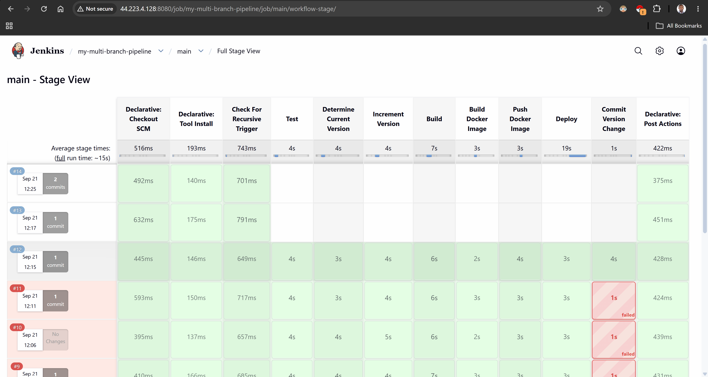
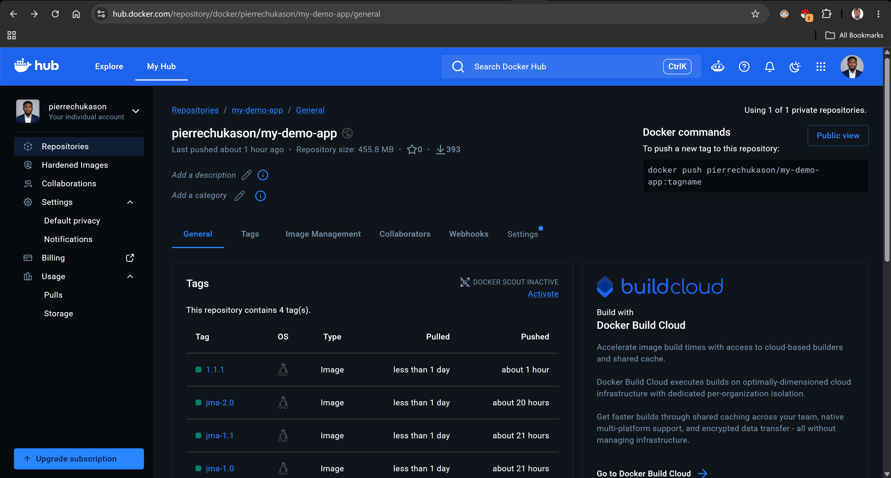
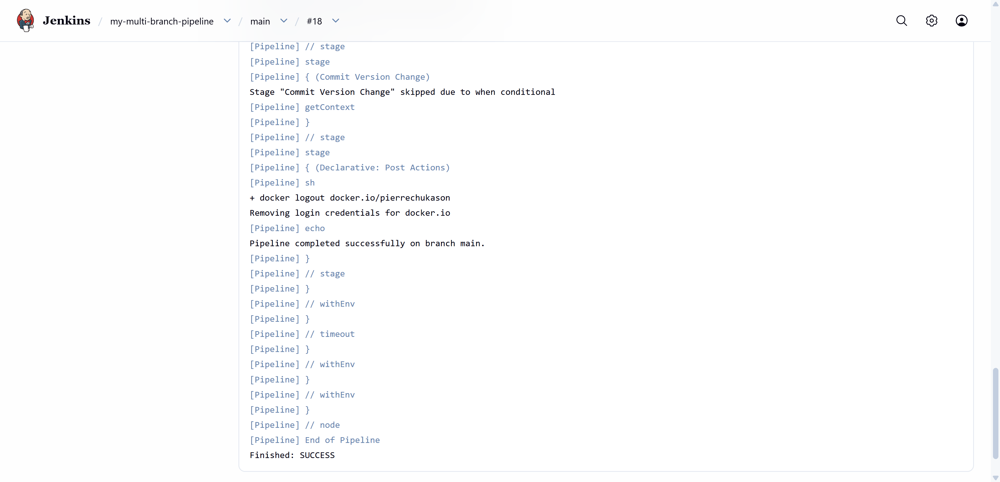
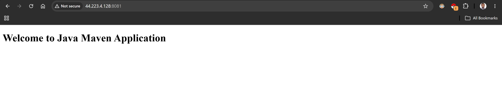
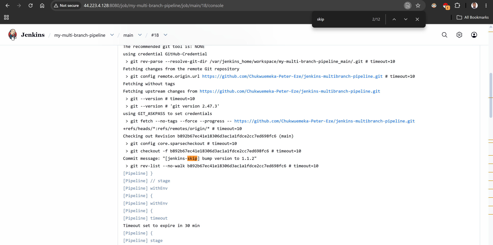
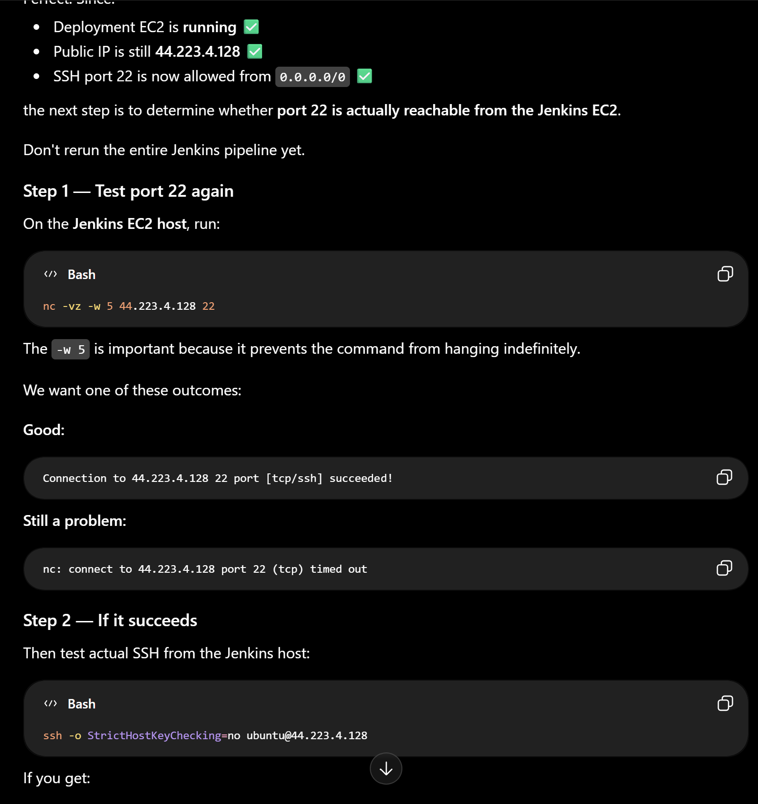

# Jenkins Multibranch Pipeline

> Branch-aware CI/CD workflows using Jenkins Multibranch Pipelines, secure credentials, Git webhooks, automated application version management, Docker image versioning, and automated deployment.

[](#)
[](#)
[](#)
[](#)
[](#)
[](#)
[](#)

---

## Project Status

| Capability                                    | Status      |
| --------------------------------------------- | ----------- |
| Multibranch Pipeline job and branch discovery | Implemented |
| Branch-specific pipeline logic                | Implemented |
| Jenkins Credentials integration               | Implemented |
| Git webhook trigger                           | Implemented |
| Automated application version incrementing    | Implemented |
| Maven build automation                        | Implemented |
| Docker image build and version tagging        | Implemented |
| Docker Hub image publishing                   | Implemented |
| Automated Docker deployment                   | Implemented |
| Automated version commit back to Git          | Implemented |
| Recursive-trigger prevention                  | Implemented |
| End-to-end CI/CD workflow                     | Implemented |

The `Jenkinsfile` in this repository contains the pipeline implementation described below.

The project has been tested through a complete workflow from source-control change through application build, Docker image publication, deployment, and automated version write-back to Git.

---

## Table of Contents

* [Overview](#overview)
* [Engineering Problem](#engineering-problem)
* [Solution](#solution)
* [Project Objectives](#project-objectives)
* [Engineering Highlights](#engineering-highlights)
* [Architecture](#architecture)
* [CI/CD Workflow](#cicd-workflow)
* [Multibranch Pipeline](#multibranch-pipeline)
* [Branch-Based Pipeline Logic](#branch-based-pipeline-logic)
* [Credentials Management](#credentials-management)
* [Webhook Automation](#webhook-automation)
* [Application Versioning](#application-versioning)
* [Versioning Workflow](#versioning-workflow)
* [Docker Image Versioning](#docker-image-versioning)
* [Deployment Workflow](#deployment-workflow)
* [Automated Git Version Commit](#automated-git-version-commit)
* [Preventing Recursive Pipeline Execution](#preventing-recursive-pipeline-execution)
* [Technology Stack](#technology-stack)
* [Repository Structure](#repository-structure)
* [Setup & Configuration](#setup--configuration)
* [Security Considerations](#security-considerations)
* [Troubleshooting](#troubleshooting)
* [Engineering Decisions](#engineering-decisions)
* [Lessons Learned](#lessons-learned)
* [Current Architecture Limitations](#current-architecture-limitations)
* [Future Improvements](#future-improvements)
* [Related Projects](#related-projects)
* [Connect](#connect)
* [License](#license)

---

## Overview

Modern application repositories commonly contain multiple branches representing different stages of development and delivery.

A CI/CD system needs to discover these branches, execute the appropriate pipeline logic, securely access required resources, respond to repository changes, manage application versions consistently, publish build artifacts, and deploy the resulting application.

This project implements a Jenkins-based CI/CD workflow using:

* Jenkins Multibranch Pipelines
* Branch-aware Jenkinsfile logic
* Jenkins Credentials
* Git webhooks
* Maven
* Automated application versioning
* Docker image versioning
* Docker Hub
* SSH-based deployment
* Automated Git version write-back
* Recursive-trigger protection

The result is a branch-aware pipeline that connects source-control activity with automated build, containerization, publishing, deployment, and version-management processes.



*Full pipeline run showing the CI/CD workflow progressing from source validation through Docker deployment.*

---

## Engineering Problem

A single static Jenkins pipeline becomes increasingly difficult to manage when a repository contains multiple active branches.

Different branches may require different levels of validation and delivery:

```text
feature/*
    ↓
Validation / build

develop
    ↓
Integration build + Docker image publication

main
    ↓
Full CI/CD workflow + deployment
```

At the same time, the pipeline needs secure credentials to interact with external systems such as GitHub, Docker Hub, and the deployment environment.

Application versioning introduces another engineering consideration.

If Jenkins changes the application version and commits that change back to Git, the resulting Git push can trigger another pipeline execution through the repository webhook.

Without a control mechanism, this can create a feedback loop:

```text
Pipeline
   ↓
Version change
   ↓
Git commit
   ↓
Git push
   ↓
Webhook
   ↓
Pipeline
   ↓
Version change
   ↓
...
```

### The engineering challenge

> How can Jenkins automatically discover and build multiple branches, apply branch-specific behavior, securely access required resources, manage application versions, publish and deploy versioned Docker images, write version changes back to Git, and prevent Jenkins-generated commits from causing unintended recursive execution?

---

## Solution

The project uses Jenkins Multibranch Pipeline capabilities combined with branch-aware conditions inside a single `Jenkinsfile`.

```text
Git Repository
      │
      │ Push / Webhook
      ▼
GitHub
      │
      ▼
Jenkins Multibranch Pipeline
      │
      ├── Discover branch
      │
      ├── Load branch Jenkinsfile
      │
      ├── Check recursive-trigger marker
      │
      ├── Run tests
      │
      ├── Determine application version
      │
      ├── Increment version
      │
      ├── Build Maven application
      │
      ├── Build Docker image
      │
      ├── Push image to Docker Hub
      │
      ├── Deploy on main
      │
      └── Commit version change
              │
              ▼
        Git Repository
              │
              ▼
       Trigger protection
```

The current implementation runs Jenkins and the Docker deployment target on the same AWS EC2 instance.

This is intentional for the current learning project and allows the complete CI/CD workflow to be demonstrated on a single infrastructure environment.

---

## Project Objectives

* Create a Jenkins Multibranch Pipeline.
* Implement Git-based branch discovery.
* Implement branch-specific pipeline behavior.
* Configure secure Jenkins credentials.
* Trigger Jenkins execution through repository webhooks.
* Automatically determine the Maven application version.
* Automatically increment the patch version.
* Build the Java application with Maven.
* Build a versioned Docker image.
* Publish the image to Docker Hub.
* Deploy the image automatically from the `main` branch.
* Commit the updated application version back to Git.
* Prevent Jenkins-generated commits from causing an unintended recursive pipeline execution.
* Document the engineering decisions and troubleshooting process.

---

## Engineering Highlights

* Branch-aware CI/CD design.
* Pipeline-as-code.
* Jenkins Multibranch Pipeline.
* Automated source-control integration.
* Secure credential handling.
* Event-driven pipeline triggering.
* Automated patch-version management.
* Version-aligned Docker image tags.
* Docker Hub image publishing.
* SSH-based deployment.
* Automated Git write-back.
* Recursive-trigger prevention.
* Controlled Jenkins-generated commits.
* Separation of pipeline responsibilities by branch.

---

# Architecture

The current infrastructure uses AWS EC2 as the execution environment.

```text
                         ┌──────────────────────┐
                         │      GitHub Repo      │
                         │                      │
                         │  main                │
                         │  develop             │
                         │  feature/*           │
                         └──────────┬───────────┘
                                    │
                                    │ Webhook
                                    ▼
                         ┌──────────────────────┐
                         │       Jenkins        │
                         │                      │
                         │ Multibranch Pipeline │
                         └──────────┬───────────┘
                                    │
                   ┌────────────────┼────────────────┐
                   │                │                │
                   ▼                ▼                ▼
                main            develop          feature/*
                   │                │                │
                   └────────────────┼────────────────┘
                                    │
                                    ▼
                              Jenkinsfile
                                    │
              ┌─────────────────────┼─────────────────────┐
              │                     │                     │
              ▼                     ▼                     ▼
             Test              Maven Build          Versioning
                                                        │
                                                        ▼
                                                 Docker Image
                                                        │
                                                        ▼
                                                   Docker Hub
                                                        │
                                                        ▼
                                                   Deployment
                                                        │
                                                        ▼
                                                 Application
                                                        │
                                                        ▼
                                               Git Version Commit
                                                        │
                                                        ▼
                                               Trigger Protection
```

### Current EC2 port layout

Jenkins itself occupies host port `8080`.

The deployed application listens on container port `8080`, but is exposed on host port `8081` to avoid a port conflict.

```text
AWS EC2 Host
│
├── Jenkins container
│      └── host 8080 → container 8080
│
└── my-demo-app container
       └── host 8081 → container 8080
```

Therefore the deployed application is accessed through:

```text
http://<EC2-public-ip>:8081
```

---

# CI/CD Workflow

The current pipeline follows this general flow:

```text
Developer pushes change
        ↓
GitHub receives change
        ↓
GitHub webhook notifies Jenkins
        ↓
Jenkins identifies affected branch
        ↓
Multibranch Pipeline selects branch
        ↓
Branch Jenkinsfile is loaded
        ↓
Check for Jenkins-generated commit
        ↓
Run tests
        ↓
Determine current version
        ↓
Increment patch version
        ↓
Build Java application
        ↓
Build Docker image
        ↓
Push Docker image to Docker Hub
        ↓
Deploy on main
        ↓
Commit version change to Git
        ↓
GitHub webhook
        ↓
Jenkins detects [jenkins-skip]
        ↓
Recursive execution is skipped
```

---

# Multibranch Pipeline

A Multibranch Pipeline allows Jenkins to discover branches containing pipeline definitions and create corresponding pipeline jobs automatically.

Instead of manually creating a separate Jenkins job for every branch, Jenkins evaluates the repository and associates the pipeline definition with each discovered branch.

## Concept

```text
Repository

├── main
│   └── Jenkinsfile
│
├── develop
│   └── Jenkinsfile
│
├── feature/login
│   └── Jenkinsfile
│
└── feature/payment
    └── Jenkinsfile
```

Jenkins discovers the branches and evaluates the `Jenkinsfile` associated with each branch.


*Jenkins job view showing branches discovered from the repository.*

---

# Branch-Based Pipeline Logic

The pipeline applies different behavior depending on the current branch.

## `main`

The `main` branch executes the complete workflow:

```text
Test
 ↓
Version
 ↓
Maven Build
 ↓
Docker Build
 ↓
Docker Push
 ↓
Deploy
 ↓
Git Version Commit
```

## `develop`

The `develop` branch performs build and publishing activities but does not execute the deployment stage:

```text
Test
 ↓
Version
 ↓
Maven Build
 ↓
Docker Build
 ↓
Docker Push
 ↓
Git Version Commit
```

## `feature/*`

Feature branches are used primarily for validation and application builds.

The current Jenkinsfile does not build or publish Docker images from feature branches because the Docker stages are restricted to `main` and `develop`.

```text
Test
 ↓
Maven Build
```

This allows feature branches to receive CI validation without automatically publishing or deploying container images.


*Stage view demonstrating branch-specific pipeline behavior.*

---

# Credentials Management

CI/CD pipelines frequently require authentication to external systems such as:

* GitHub
* Docker Hub
* Deployment servers
* Cloud infrastructure

Sensitive credentials are not stored directly in the Jenkinsfile.

Instead, Jenkins Credentials are referenced by credential ID and injected only into the stages that require them.

```text
Jenkinsfile
     │
     │ credential ID
     ▼
Jenkins Credentials Store
     │
     ▼
Temporary credential binding
     │
     ▼
Authenticated operation
```

The current pipeline uses credentials for:

| Credential               | Purpose                           |
| ------------------------ | --------------------------------- |
| `Docker-Hub-Credentials` | Docker Hub authentication         |
| `deploy-ssh-credentials` | SSH authentication for deployment |
| `GitHub-PAT`             | GitHub write-back authentication  |

The actual secret values remain outside the source repository.


*Jenkins credentials configuration showing credential IDs while secret values remain hidden.*

---

# Webhook Automation

Manual pipeline execution does not provide a fully event-driven CI/CD workflow.

A GitHub webhook allows repository activity to notify Jenkins.

```text
Git Push
   │
   ▼
GitHub Webhook
   │
   ▼
Jenkins
   │
   ▼
Multibranch Pipeline
   │
   ▼
Branch Build
```


*GitHub repository webhook configuration used to notify Jenkins.*

### Security considerations

A webhook endpoint is an entry point into the CI system.

Relevant considerations include:

* Authentication.
* Secret tokens where supported.
* Source validation.
* Network exposure.
* Jenkins security configuration.
* Administrative access controls.
* Monitoring and logging.

---

# Application Versioning

Application versioning provides a traceable relationship between source code, application version, container image, and deployment artifact.

```text
Source Code
     ↓
pom.xml Version
     ↓
Docker Image Tag
     ↓
Deployment
```

The pipeline reads the current Maven version from `pom.xml` and automatically increments the patch component.

For example:

```text
1.1.0
  ↓
1.1.1
```

The resulting version becomes the Docker image tag:

```text
docker.io/pierrechukason/my-demo-app:1.1.1
```

---

# Versioning Workflow

The current versioning process is:

```text
Current Version
      │
      ▼
Read pom.xml
      │
      ▼
Increment Patch Version
      │
      ▼
Update pom.xml
      │
      ▼
Build Application
      │
      ▼
Build Docker Image
      │
      ▼
Tag Image With New Version
      │
      ▼
Push Image
      │
      ▼
Deploy
      │
      ▼
Commit Version Change
```


*Console output showing the application version being read and incremented.*

---

# Docker Image Versioning

The Docker image tag is derived from the application version.

For example:

```text
Application version:
1.1.1

Docker image:
docker.io/pierrechukason/my-demo-app:1.1.1
```

This creates a direct relationship between the Maven application version and the published Docker image.

```text
pom.xml
   │
   │ version = 1.1.1
   ▼
Jenkins
   │
   ▼
Docker Build
   │
   ▼
my-demo-app:1.1.1
   │
   ▼
Docker Hub
   │
   ▼
Deployment
```

The pipeline does not modify the Dockerfile version itself. Instead, the Docker image is tagged using the application version generated during the pipeline.



*Docker Hub repository showing versioned application images.*

---

# Deployment Workflow

Deployment occurs only from the `main` branch.

The current deployment process uses SSH to connect to the EC2 deployment environment.

```text
Jenkins
   │
   │ SSH
   ▼
AWS EC2
   │
   ├── Docker login
   │
   ├── Docker pull
   │
   ├── Stop previous container
   │
   ├── Remove previous container
   │
   ├── Start new container
   │
   └── Docker logout
```

The image is pulled from Docker Hub:

```text
docker.io/pierrechukason/my-demo-app:<version>
```

The existing application container is then replaced with the newly published version.

### Container port mapping

The application listens on port `8080` inside the container.

Jenkins already occupies host port `8080`, so the application is exposed through host port `8081`.

```text
EC2 host:8081
      │
      ▼
Docker container:8080
```

The deployment command is effectively:

```bash
docker run -d \
  --name my-demo-app \
  -p 8081:8080 \
  docker.io/pierrechukason/my-demo-app:<version>
```



*Deploy stage completing successfully in Jenkins.*



*The deployed application responding successfully through the configured application port.*

---

# Automated Git Version Commit

After a successful `main` or `develop` pipeline, Jenkins commits the updated `pom.xml` version back to the repository.

The commit message follows this format:

```text
[jenkins-skip] bump version to 1.1.1
```

The `[jenkins-skip]` marker is intentionally included so that Jenkins can identify its own version-management commits.

GitHub authentication is handled through the Jenkins `GitHub-PAT` credential rather than storing a personal access token in the repository.

The pipeline uses a temporary `GIT_ASKPASS` helper during the Git operation so that the credentials do not need to be embedded directly in the Git remote URL.

```text
Pipeline
   ↓
Update pom.xml
   ↓
git add
   ↓
git commit
   ↓
GitHub authentication via Jenkins credential
   ↓
git push
```


*Git history showing an automated Jenkins version-bump commit.*

---

# Preventing Recursive Pipeline Execution

Automated Git commits introduce a potential feedback loop.

Without protection:

```text
Pipeline
   ↓
Update version
   ↓
Commit
   ↓
Push
   ↓
Webhook
   ↓
Pipeline
   ↓
Update version
   ↓
Commit
   ↓
Push
   ↓
...
```

The pipeline prevents this by inspecting the most recent commit message.

The Jenkins-generated commit contains:

```text
[jenkins-skip]
```

When the webhook causes Jenkins to process that commit, the first pipeline stage checks the commit message.

If the marker is present:

```text
Last commit was a Jenkins version-commit ([jenkins-skip]).
Skipping the rest of the pipeline to avoid a recursive build loop.
```

The pipeline sets:

```text
SKIP_BUILD=true
```

and the remaining build, Docker, deployment, and version-commit stages are skipped.

### Actual control flow

```text
Developer Commit
      ↓
Webhook
      ↓
Full Pipeline
      ↓
Jenkins Version Commit
      ↓
Webhook
      ↓
Pipeline starts
      ↓
Check commit message
      ↓
[jenkins-skip] detected
      ↓
SKIP_BUILD=true
      ↓
Remaining stages skipped
```



*Pipeline execution showing Jenkins-generated commits being detected and prevented from triggering another full CI/CD cycle.*

This is a core part of the pipeline design rather than simply an error-handling mechanism.

---

# Technology Stack

| Technology                   | Purpose                                               |
| ---------------------------- | ----------------------------------------------------- |
| AWS EC2                      | Infrastructure for Jenkins and application deployment |
| Ubuntu Linux                 | Operating system                                      |
| Git                          | Version control                                       |
| GitHub                       | Source-control repository and webhook source          |
| Jenkins                      | CI/CD orchestration                                   |
| Jenkins Pipeline             | Pipeline-as-code                                      |
| Jenkins Multibranch Pipeline | Branch-aware automation                               |
| Groovy                       | Jenkins pipeline implementation                       |
| Java 17                      | Application development                               |
| Apache Maven                 | Build automation and version management               |
| Docker                       | Containerization                                      |
| Docker Hub                   | Container registry                                    |
| SSH                          | Secure deployment connection                          |

---

# Repository Structure

```text
jenkins-multibranch-pipeline/
│
├── README.md
├── LICENSE
│
├── src/
│   └── main/
│       └── java/
│
├── Jenkinsfile
├── Dockerfile
├── pom.xml
│
├── docs/
│   ├── setup.md
│   ├── credentials.md
│   ├── commands.md
│   ├── troubleshooting.md
│   ├── versioning.md
│   ├── webhooks.md
│   └── lessons-learned.md
│
└── media/
    └── screenshots/
```

---

# Setup & Configuration

The current pipeline requires the following components:

### Jenkins

A Jenkins instance running on AWS EC2 with the required pipeline and SSH functionality.

### Docker

Docker must be available to the Jenkins execution environment because Jenkins builds and publishes Docker images.

### Docker Hub

A Docker Hub repository is used to store the versioned application images.

Example:

```text
docker.io/pierrechukason/my-demo-app
```

### Jenkins Credentials

The following Jenkins credentials are referenced by the pipeline:

```text
Docker-Hub-Credentials
deploy-ssh-credentials
GitHub-PAT
```

Credential values should never be committed to Git.

### GitHub webhook

The repository is configured to notify Jenkins when relevant repository activity occurs.

### Deployment environment

The current learning implementation uses the same AWS EC2 environment for Jenkins and Docker-based application deployment.

This simplifies the infrastructure while allowing the complete CI/CD workflow to be demonstrated.

Detailed configuration information is documented in:

* [docs/setup.md](docs/setup.md)
* [docs/credentials.md](docs/credentials.md)
* [docs/commands.md](docs/commands.md)
* [docs/troubleshooting.md](docs/troubleshooting.md)
* [docs/versioning.md](docs/versioning.md)
* [docs/webhooks.md](docs/webhooks.md)
* [docs/lessons-learned.md](docs/lessons-learned.md)

---

# Security Considerations

The project intentionally uses Jenkins Credentials instead of storing secrets in source code.

Important security practices include:

* Never commit secrets.
* Never hard-code passwords or access tokens in Jenkinsfiles.
* Use Jenkins Credentials for sensitive values.
* Limit credential permissions.
* Avoid printing secrets to logs.
* Use dedicated credentials where appropriate.
* Protect Jenkins administrative access.
* Protect webhook endpoints.
* Restrict network access where possible.
* Review Jenkins-generated Git commits.
* Follow least-privilege principles.
* Remove unnecessary credentials from deployment environments.
* Log out of Docker Hub after deployment authentication where appropriate.

The deployment workflow authenticates to Docker Hub using Jenkins-managed credentials and logs out after the image has been pulled.

---

# Troubleshooting

This project involved several real implementation challenges during development.

Examples include:

### Docker permission problems

The Jenkins container initially could not access the Docker daemon because the Jenkins process did not have the required Docker group permissions.

The Docker group mapping was corrected so Jenkins could execute Docker commands.

### SSH connectivity

Initial SSH connectivity to the deployment target failed.

The issue was investigated through:

* EC2 security-group configuration.
* Port 22 connectivity.
* SSH key configuration.
* `authorized_keys`.
* SSH-agent verification.

The correct Jenkins deployment key was eventually confirmed.

### SSH authentication

The deployment SSH credential was verified against the authorized ED25519 public key on the target environment.

### Docker Hub authentication

The deployment environment initially attempted an interactive Docker login, which failed because Jenkins was executing the command non-interactively.

The login was changed to use:

```text
--password-stdin
```

with Jenkins-managed credentials.

### Host port conflict

Jenkins was already using host port `8080`.

Attempting to deploy the application using:

```text
-p 8080:8080
```

therefore failed.

The deployment was changed to:

```text
-p 8081:8080
```

allowing Jenkins and the application to coexist on the same EC2 host.

### GitHub authentication

The first Git push implementation attempted to inject Git credentials directly into the HTTPS remote URL.

Shell/Groovy variable escaping caused the credentials to be passed incorrectly.

The final implementation uses Jenkins Credentials together with `GIT_ASKPASS` for Git authentication.

### Recursive pipeline execution

Because Jenkins commits the updated version back to Git, its own commit can trigger another webhook event.

The `[jenkins-skip]` marker and `SKIP_BUILD` logic prevent the resulting build from executing the full pipeline again.

Detailed troubleshooting notes will be maintained separately in:

```text
docs/troubleshooting.md
```



*A real implementation failure encountered during development and the resulting troubleshooting process.*

---

# Engineering Decisions

## Multibranch Pipeline instead of individual jobs

A Multibranch Pipeline provides a scalable mechanism for branch-aware CI/CD rather than requiring a manually maintained Jenkins job for every branch.

## Credentials instead of hard-coded secrets

Sensitive values belong in Jenkins' credential-management system rather than source code.

## Webhooks instead of manual builds

Repository events provide a more responsive CI/CD workflow than relying exclusively on manually triggered builds.

## Automated versioning

Automating patch-version changes reduces manual intervention and provides a consistent relationship between the application version and Docker image tag.

## Versioned Docker images

Using the application version as the Docker image tag makes deployed artifacts traceable.

For example:

```text
Application:
1.1.1

Docker image:
my-demo-app:1.1.1
```

## SSH-based deployment

SSH provides a straightforward mechanism for demonstrating remote Docker deployment as part of the CI/CD workflow.

## Recursive-trigger protection

Because Jenkins writes version changes back to Git, the pipeline must distinguish between developer-generated commits and Jenkins-generated version commits.

The `[jenkins-skip]` marker provides that distinction.

## Single EC2 environment for the current implementation

Jenkins and the application deployment currently share the same EC2 host.

This reduces infrastructure complexity for the learning project while still demonstrating:

* CI/CD orchestration.
* Docker image publishing.
* SSH-based deployment.
* Application replacement.
* Version management.
* Git write-back.
* Recursive-trigger protection.

The architecture can later be expanded into separate Jenkins and deployment infrastructure.

---

# Lessons Learned

This project reinforced several practical DevOps concepts that are easy to underestimate when learning them individually.

### 1. CI/CD is an interconnected system

A pipeline can have individually working stages but still fail because two stages interact incorrectly.

For example:

```text
Jenkins
   ↓
Docker
   ↓
SSH
   ↓
Docker Hub
   ↓
GitHub
```

A failure in any one integration can stop the complete workflow.

### 2. Credentials are part of pipeline architecture

Credential management is not an afterthought.

Docker Hub, GitHub, and SSH all required different authentication mechanisms, and each needed to be handled without exposing secrets in source control.

### 3. Infrastructure constraints affect application deployment

The application initially attempted to use host port `8080`, but Jenkins was already using that port.

The solution was not to change the application's internal port but to change the host-to-container mapping:

```text
8081:8080
```

This reinforced the distinction between a container's internal port and the host port exposed externally.

### 4. Automated Git writes create new events

Once a CI/CD system starts modifying its own repository, those changes become new source-control events.

That means automation needs to account for its own side effects.

### 5. Shell quoting matters

Jenkinsfiles combine:

* Groovy
* shell commands
* environment variables
* SSH
* credential bindings

Variables can therefore behave differently depending on which layer is interpreting them.

The Git authentication problem demonstrated why authentication mechanisms should be designed carefully rather than relying on increasingly complex shell escaping.

### 6. Successful deployment is more than building an image

A successful container build does not necessarily mean successful delivery.

The complete workflow had to verify:

```text
Build
 ↓
Image
 ↓
Registry
 ↓
Authentication
 ↓
Pull
 ↓
Container replacement
 ↓
Application startup
 ↓
Application availability
```

### 7. Troubleshooting is part of engineering

The final pipeline is not simply the result of writing a Jenkinsfile.

It is the result of:

```text
Implement
   ↓
Observe
   ↓
Diagnose
   ↓
Change
   ↓
Test
   ↓
Verify
```

The troubleshooting process will be documented separately so that the failures and their solutions remain part of the project's engineering record.

---

# Current Architecture Limitations

The current implementation intentionally keeps the infrastructure simple, but there are several limitations.

## Jenkins and deployment share the same EC2 host

Jenkins and the application deployment currently run on the same EC2 instance.

This means the deployment is not yet demonstrating a true multi-server production topology.

## Jenkins host port conflict

Because Jenkins occupies host port `8080`, the application is exposed on host port `8081`.

## SSH deployment

The current deployment model uses SSH and Docker commands directly rather than a dedicated deployment platform or GitOps workflow.

## Single deployment environment

The project currently demonstrates a single deployment target rather than separate development, staging, and production environments.

These limitations are intentional opportunities for future iterations of the project.

---

# Future Improvements

Potential future improvements include:

* Separate Jenkins and deployment EC2 instances.
* Restrict SSH access to trusted sources rather than broad internet access.
* Infrastructure as Code with Terraform.
* Jenkins Shared Library integration.
* Automated Jenkinsfile validation.
* Semantic versioning automation.
* Automated Git release tags.
* Artifact promotion between environments.
* Container image vulnerability scanning.
* Dependency security scanning.
* Secrets management with a dedicated secrets platform.
* Deployment to Kubernetes.
* AWS EKS deployment.
* GitOps-based deployment.
* Pipeline observability.
* Automated rollback.
* Health checks after deployment.
* Progressive delivery.
* Approval gates for production environments.
* Blue/green deployment.
* Canary deployment.
* Container orchestration.
* Deployment metrics and alerting.

The next architectural evolution would be to separate the Jenkins infrastructure from the application deployment infrastructure and eventually move the deployment workflow toward Kubernetes/EKS and GitOps.

---

# Related Projects

### Jenkins CI Pipeline

[jenkins-ci-pipeline](https://github.com/Chukwuemeka-Peter-Eze/jenkins-ci-pipeline)

A Jenkins CI pipeline implementation demonstrating continuous integration concepts.

### Jenkins Shared Library

[jenkins-shared-library](https://github.com/Chukwuemeka-Peter-Eze/jenkins-shared-library)

A Jenkins Shared Library project exploring reusable pipeline components and centralized pipeline logic.

---

# Connect

**GitHub:**
https://github.com/Chukwuemeka-Peter-Eze

**LinkedIn:**
https://www.linkedin.com/in/chukwuemekapetereze/

If you found this repository useful, consider giving it a star.

---

# License

This project is licensed under the MIT License. See the `LICENSE` file for details.
